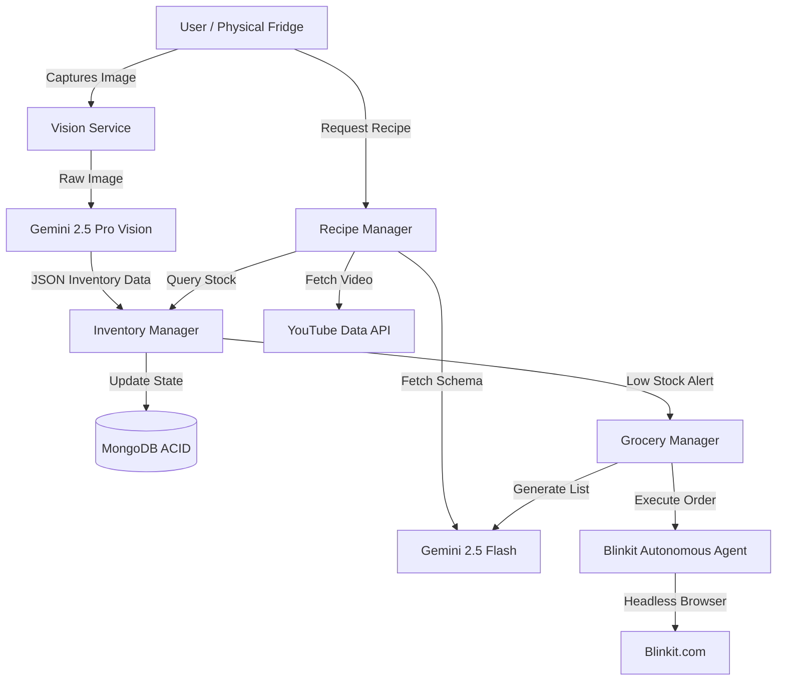

# Fresh-Scan MVP: Enterprise Smart Kitchen System
    

> **"Transforming your physical pantry into a digital asset."**

**Fresh-Scan MVP** is a state-of-the-art, AI-driven inventory management solution designed for modern smart kitchens. By orchestrating Computer Vision (Gemini 2.5 Pro), Large Language Models (Gemini 2.5 Flash), and Agentic Automation (Playwright), it creates a seamless bridge between your physical fridge and your digital shopping cart (Blinkit).

---

## Table of Contents
1.  [System Architecture](#-system-architecture)
2.  [Core Module Deep Dive](#-core-module-deep-dive)
3.  [Installation & Setup](#-installation--setup)
4.  [Configuration Reference](#-configuration-reference)
5.  [Usage Guide](#-usage-guide)
6.  [Troubleshooting & Support](#-troubleshooting--support)
7.  [Hardware Module](#-hardware-module)

---

## System Architecture

The system utilizes a **Modular Monolith** architecture, ensuring high cohesion and low coupling between components.

### High-Level Data Flow


### Key Technical Patterns
*   **Circuit Breaker**: Protects the core system from external API failures (Gemini, YouTube).
*   **Optimistic Locking**: Uses `version` fields in MongoDB documents to prevent concurrent modification conflicts during inventory updates.
*   **Agentic State Machine**: The Blinkit integration isn't just a script; it's a state machine that handles login challenges, location prompts, and payment gateways dynamically.
*   **Secure Session Storage**: Uses `weakref` and custom `ServiceInstancePool` to manage heavy browser contexts, ensuring memory safety.

---

## Core Module Deep Dive

### 1. Vision & Inventory Engine (`src/services/vision.py`, `inventory.py`)
*   **Dual-Mode Scanning**: Supports both local USB webcams and remote Raspberry Pi camera streams via Cloudflare Tunnels.
*   **Nutrient Analysis**: Extracts not just item names, but estimates freshness and nutritional density using Vision LLM.
*   **Lifecycle Tracking**: Tracks `added_date`, `expiry_date`, and `consumption_rate` to predict when you'll run out of milk before you actually do.

### 2. Autonomous Procurement Agent (`src/services/integrations/blinkit.py`)
This is the "Brain" of the operation. It autonomously manages the shopping lifecycle:
*   **Session Isolation**: Each user gets a private browser context. Your cookies are never shared.
*   **Intelligent Ranking Algorithm**:
    *   Items are scored (0-100) based on:
        *   **Name Match (40%)**: Levenshtein distance between search term and product title.
        *   **Price Optimality (20%)**: Prefers items closer to historical average price.
        *   **Brand Loyalty (20%)**: Checks your purchase history for brand preferences.
        *   **Availability (20%)**: Real-time stock checking.
*   **Anti-Bot evasion**: Implements human-like typing delays (~120ms - 450ms) and random mouse movements.

### 3. Authentication & Security (`src/auth/`)
*   **OAuth 2.0**: Native Google Sign-In integration.
*   **JWT Architecture**:
    *   `Access Token` (15 min): Short-lived for security.
    *   `Refresh Token` (30 days): Rotated on reuse to prevent replay attacks.
*   **BCrypt Hashing**: Cost factor 12 for robust password protection.

---

## Installation & Setup

### Prerequisites
*   **OS**: Windows 10/11, macOS, or Linux (Ubuntu 20.04+).
*   **Runtime**: Python 3.12+ (Preferred), Node.js 18+ (for Playwright).
*   **Database**: MongoDB 6.0+ (Local or Atlas Free Tier).

### Step 1: Clone & Prepare
```bash
git clone https://github.com/YourUsername/Fresh-Scan-MVP.git
cd Fresh-Scan-MVP
python -m venv .venv
# Windows
.\.venv\Scripts\activate
# Linux/Mac
source .venv/bin/activate
```

### Step 2: Install Dependencies
```bash
pip install -r requirements.txt
playwright install chromium
```

### Step 3: Initialize System
Run the setup scripts to create database indexes and configure the auth system.
```bash
python scripts/create_auth_indexes.py
python scripts/setup_auth.py
```

---

## Configuration Reference

Create a `.env` file in the root directory. Use the table below as a reference.

### Essential Application Settings
| Variable | Required | Default | Description |
| :--- | :---: | :--- | :--- |
| `MONGO_URI` | Yes | `mongodb://localhost:27017/` | Connection string for MongoDB. |
| `DATABASE_NAME` | Yes | `SmartKitchen` | Name of the database. |
| `SECRET_KEY` | Yes | - | 32-byte generic secret for crypto operations. |

### Authentication (JWT & Google)
| Variable | Required | Description |
| :--- | :---: | :--- |
| `JWT_SECRET_KEY` | Yes | Strong secret for signing JWT tokens. |
| `JWT_ACCESS_TOKEN_EXPIRY` | No | `900` (15 mins). |
| `GOOGLE_CLIENT_ID` | Warning | Required if `ENABLE_GOOGLE_OAUTH=true`. |
| `GOOGLE_CLIENT_SECRET` | Warning | Required if `ENABLE_GOOGLE_OAUTH=true`. |

### Agentic Integration (Blinkit)
| Variable | Required | Default | Description |
| :--- | :---: | :--- | :--- |
| `BLINKIT_HEADLESS` | No | `false` | Run browser in background? set `false` for debugging. |
| `BLINKIT_TIMEOUT` | No | `60000` | Browser operation timeout in ms. |

### Hardware Integration
| Variable | Required | Description |
| :--- | :---: | :--- |
| `CLOUDFLARE_DOMAIN` | No | Domain for remote Raspberry Pi camera. |
| `CAMERA_API_KEY` | No | Handshake key for secure camera streaming. |

---

## Usage Guide

Start the application:
```bash
python main.py
```

### The Interface
The CLI uses a flattened menu structure optimized for speed.

1.  **Scan Fridge**: 
    *   *Action*: Triggers the camera. 
    *   *Result*: Updates inventory, logs new items, and alerts on expiring ones.
2.  **View Inventory**: 
    *   *Action*: Displays a formatted table of current stock.
3.  **Manage Items**:
    *   *Action*: Manual CRUD (Create, Read, Update, Delete) for when you eat a snack without scanning.
4.  **Get Recipes**:
    *   *Action*: AI queries. "What can I cook with [Inventory]?" 
    *   *Result*: Returns recipes + YouTube tutorial links.
5.  **Shopping Lists**:
    *   *Action*: Generates lists from low-stock items or chosen recipes.
    *   *Feature*: **"Order via Blinkit"** triggers the autonomous agent.
6.  **My Account**:
    *   *Action*: View login history, system status, and manage profile preferences (Veg/Non-Veg).

---

## Troubleshooting & Support

### Common Issues

**1. `DatabaseConnectionError: ServerSelectionTimeoutError`**
*   *Cause*: MongoDB is not running or URI is incorrect.
*   *Fix*: Ensure `mongod` service is started. Check `MONGO_URI` in `.env`.

**2. `Playwright Error: Browser closed unexpectedly`**
*   *Cause*: Browser crashed or ran out of memory.
*   *Fix*: Set `BLINKIT_HEADLESS=false` to see the crash. Ensure you aren't running as root/admin if not needed.

**3. `Integration Module Not Found`**
*   *Cause*: Missing `src/services/integrations/blinkit.py`.
*   *Fix*: Ensure you are on the `feature/blinkit-integration` branch or have pulled the latest main.

**4. "Camera Unavailable"**
*   *Cause*: Main app cannot hit the Cloudflare endpoint.
*   *Fix*: Check `CLOUDFLARE_DOMAIN` in `.env` and ensure the Pi is online.

### Integration Support
For Google OAuth setup, ensure your redirect URI in Google Cloud Console matches:
`http://localhost:3000/auth/callback` (Even though this is CLI, the auth flow mimics this for consistency).

---

## Hardware Module
For setting up the physical camera node, please refer to [raspberry_pi/README.md](raspberry_pi/README.md).

---
**Maintained by Team FreshScan**